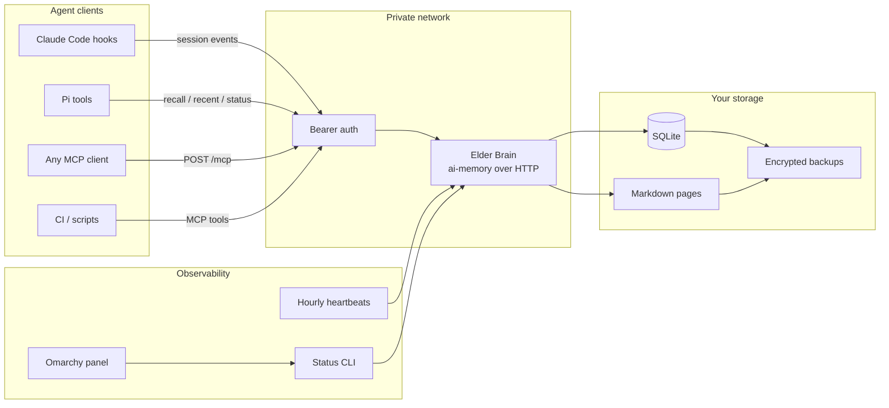

<div align="center">


# Elder Brain

**One private memory plane for every AI agent you run.**

Keep session experience synchronized across desktops, laptops, CI workers and future agent runtimes—with one self-hosted ai-memory server, one canonical scope and standard MCP-over-HTTP.

[](deploy/)
[](https://modelcontextprotocol.io)
[](docs/security.md)
[](omarchy-plugin/)
[](LICENSE)

**No SaaS control plane · No vendor memory silo · No new memory database invented here**


</div>

---

## The problem

Agents learn continuously: project conventions, corrected assumptions, deployment failures, architectural decisions and the small operational facts that prevent the next mistake.

But agent memory is usually fragmented by machine and runtime:

```text
desktop Claude memory  ≠  laptop Claude memory  ≠  Pi memory  ≠  CI memory
```

A lesson captured on one machine is invisible everywhere else. Adding more agents creates more isolated colonies instead of better collective intelligence.

## The idea

Elder Brain gives every authorized agent the same remote memory backend:

```text
one private URL + one Bearer token + one canonical workspace/project scope
```

What one agent learns on a desktop can be recalled by another agent on a laptop minutes later. The memory belongs to you, runs on your infrastructure and remains available even when individual workstations sleep.

## What Elder Brain is

Elder Brain is a **distribution around** [`akitaonrails/ai-memory`](https://github.com/akitaonrails/ai-memory), not a fork.

It deploys the upstream server unchanged and adds the operational layer required for a reliable multi-machine colony:

- private-network Docker Compose recipe;
- mandatory Bearer authentication;
- canonical scope routing across machines and working directories;
- interactive client installer;
- Claude Code hook migration;
- generic MCP-over-HTTP integration pattern;
- hourly machine heartbeat;
- Python-standard-library status CLI;
- native Omarchy health and activity panel;
- security, backup and rollback guidance.

## Architecture



### Request path

```text
agent event
   → canonical scope resolution
   → private-network HTTP request
   → Bearer authentication
   → MCP tool call
   → shared SQLite + Markdown memory
   → recall from any authorized client
```

## Core capabilities

| Capability | What it provides |
|---|---|
| **Shared memory** | One memory corpus across machines and agent runtimes |
| **Agent-agnostic protocol** | MCP-over-HTTP instead of a vendor-specific client contract |
| **Self-hosted persistence** | SQLite and Markdown stored on your own host-mounted volume |
| **Canonical scope routing** | Stable `workspace/project` identity independent of the current folder |
| **Machine presence** | Heartbeat pages identify clients seen within the last 90 minutes |
| **Operational visibility** | Health, latency, counts, machines and recent activity in CLI/Omarchy |
| **Private-by-default deploy** | Bind to Tailscale, WireGuard, LAN or loopback—not public `0.0.0.0` |
| **Portable recovery** | Back up and restore ordinary files rather than a proprietary service |

## Quick start

### 1. Deploy the server

```bash
git clone https://github.com/ibrunomendes-coder/elder-brain.git
cd elder-brain/deploy
cp .env.example .env
chmod 600 .env
```

Generate a master token and edit `.env`:

```bash
openssl rand -hex 32
$EDITOR .env
```

Minimum production values:

```dotenv
AI_MEMORY_AUTH_TOKEN=<GENERATED_TOKEN>
BIND_IP=<PRIVATE_INTERFACE_IP>
ALLOWED_HOSTS=localhost,127.0.0.1,::1,<PRIVATE_INTERFACE_IP>
```

Start and inspect:

```bash
docker compose config
docker compose up -d
docker compose ps
```

Validate the boundary:

```bash
curl -i http://<PRIVATE_INTERFACE_IP>:49374/web/
# expected: 401 without a token
```

> Publish only on a private interface. Read the [security model](docs/security.md) before deployment.

### 2. Connect each client machine

```bash
cd elder-brain
./scripts/install.sh
```

The installer collects the private URL, hidden Bearer token and canonical scope, then optionally configures:

- detected Claude Code ai-memory hooks;
- hourly machine heartbeat;
- the Omarchy status panel.

For a fully manual setup, use the [installation guide](docs/install.md).

### 3. Verify

```bash
elder-brain-status | jq
```

Expected shape:

```json
{
  "ok": true,
  "alive": true,
  "latency_ms": 34,
  "counts": {
    "pages_latest": 128,
    "sessions": 42,
    "observations": 12480
  },
  "machines": [],
  "recent": []
}
```

## Canonical scope routing

This is the most important multi-machine rule in the project.

ai-memory routes events by `workspace/project`. Without a fixed shared scope, each working directory can become a separate bucket. Nothing is deleted, but counts, machine heartbeats and recall results appear to disappear depending on the active folder.

Configure the same scope on every machine:

```text
~/.config/elder-brain/scope
```

```text
default/<YOUR_PROJECT>
```

Agent hooks also need an ai-memory marker:

```toml
# ~/.ai-memory.toml
workspace = "default"
project = "<YOUR_PROJECT>"
```

### Work trees outside `$HOME`

Marker discovery walks upward from the current working directory. A marker under `$HOME` cannot govern a project rooted at `/mnt/storage`, an external disk or another mount.

Every work root outside `$HOME` needs a marker at or above that tree:

```text
/mnt/storage/.ai-memory.toml
/path/to/synced-projects/.ai-memory.toml
```

Routing is evaluated per event, so a running session starts writing to the correct scope as soon as the marker becomes reachable.

## Client integrations

| Client | Integration model |
|---|---|
| **Claude Code** | ai-memory lifecycle hooks with remote URL and Bearer token environment variables |
| **Pi** | recall, recent and status tools calling MCP-over-HTTP |
| **Any MCP client** | JSON-RPC `tools/call` requests to `POST /mcp` |
| **Scripts / CI** | direct MCP requests with explicit canonical scope |
| **Omarchy** | bar panel backed by the standard-library status helper |

Example MCP transport headers:

```http
POST /mcp HTTP/1.1
Content-Type: application/json
Accept: application/json, text/event-stream
Authorization: Bearer <TOKEN>
```

The server may return direct JSON or Server-Sent Events; clients should support both.

## Machine heartbeat and observability

Each configured client can update:

```text
machines/<hostname>.md
```

inside the canonical scope. The page records `last_seen`; the status helper considers the machine alive for 90 minutes.

The status layer deliberately filters heartbeat pages out of recent memory activity so infrastructure noise does not replace meaningful session content.

### Status CLI

```bash
elder-brain-status
elder-brain-status --heartbeat
```

The helper uses only Python's standard library and reads:

```text
~/.config/elder-brain/url
~/.config/elder-brain/token
~/.config/elder-brain/scope
~/.config/elder-brain/machines
```

### Omarchy panel

The optional panel provides:

- live online/offline icon;
- request latency;
- page, session and observation counts;
- known machine health;
- recent non-heartbeat activity;
- keyboard navigation (`R` refresh, `Esc` close).

The source template uses `community.elder-brain`; the installer rewrites it to a user-owned plugin ID before enabling it.

## Security model

Elder Brain is a high-trust service because it stores context produced across agent sessions.

Baseline rules:

1. **Private interface only.** Use Tailscale, WireGuard, LAN or loopback.
2. **Bearer token required.** Treat it as a master password for all memory.
3. **Mode-600 client config.** Never commit or print the token.
4. **Narrow Host allowlist.** Accept only names/IPs clients actually use.
5. **Pin the container image in production.** Evaluate `latest`, then pin a tested digest.
6. **Encrypt backups before offsite transfer.** Memory archives contain session context.
7. **Treat recalled memory as untrusted input.** Shared memory is a potential cross-agent prompt-injection channel.
8. **Do not use memory as a secret store.** Anything visible to an agent may become an observation.

See [docs/security.md](docs/security.md) for trust boundaries, token rotation, LLM-provider exposure, backup encryption and incident response.

## Data ownership and backups

The durable server volume contains:

```text
SQLite database + Markdown pages
```

A complete backup is therefore ordinary filesystem data. The safe pipeline is:

```text
stop or snapshot → archive → encrypt → upload → test restore
```

The project does not bundle a backup provider. Your host remains responsible for scheduling, encryption keys, retention and restore drills.

## Repository map

| Path | Purpose |
|---|---|
| [`deploy/`](deploy/) | Parameterized Docker Compose and environment template |
| [`scripts/install.sh`](scripts/install.sh) | Interactive client-machine installer |
| [`scripts/elder-brain-status`](scripts/elder-brain-status) | Status and heartbeat CLI (Python stdlib only) |
| [`omarchy-plugin/`](omarchy-plugin/) | Omarchy bar panel template |
| [`docs/install.md`](docs/install.md) | Complete server/client installation runbook |
| [`docs/security.md`](docs/security.md) | Threat model and operational security guide |

## What Elder Brain does not do

- It does not fork or patch ai-memory.
- It does not provide public-internet hardening by default.
- It does not provide per-user or per-machine authorization.
- It does not automatically redact secrets from session observations.
- It does not make recalled memory inherently trustworthy.
- It does not replace your project knowledge base or source-of-truth documentation.
- It does not manage offsite backups for you.

The project intentionally stays small: deployment, routing, client integration and observability around an existing memory engine.

## Project status

**v0.2** — production-tested across multiple client machines and an always-on server.

The current release includes:

- canonical scope support in status and heartbeat calls;
- English-only public documentation and UI;
- redesigned native Omarchy panel;
- heartbeat filtering from recent activity;
- interactive installer with private config permissions;
- explicit security and recovery guidance.

## Credits and license

Elder Brain is built around [`akitaonrails/ai-memory`](https://github.com/akitaonrails/ai-memory) by [AkitaOnRails](https://github.com/akitaonrails). The upstream server retains its own license.

Repository code, scripts, deployment recipe and panel are [MIT licensed](LICENSE).

The illithid/Cthulhu medallion artwork is third-party and is **not** covered by this repository's MIT license.
