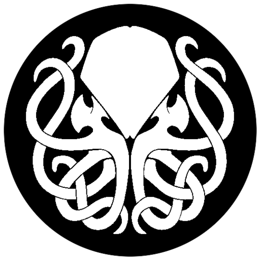
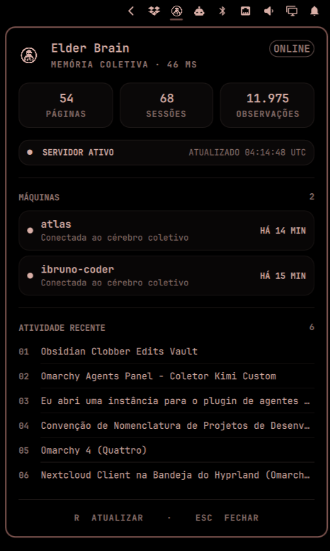

<div align="center">



# Elder Brain

**Memória coletiva para agentes de IA** — um servidor self-hosted do qual todo
agente, em toda máquina, lê e escreve.

[](LICENSE)
[](https://modelcontextprotocol.io)
[](deploy/)

[English](README.md)

</div>

O que um Claude aprendeu no teu desktop, o agente do laptop já sabe. Um
organismo vivo de memória — seu, na sua infraestrutura, fora de qualquer vendor.

<div align="center">

<br/><sub>O painel Omarchy: saúde, latência, contagens, máquinas conectadas, atividade recente.</sub>
</div>

## Por quê

Agentes de IA acumulam experiência a cada sessão — decisões, correções,
contexto suado. Por padrão essa memória morre na máquina onde nasceu. O Elder
Brain centraliza:

```
laptop ──┐
desktop ─┼─→  elder-brain (sua VPS, rede privada)  ←── qualquer máquina futura
CI ──────┘      1 token Bearer + 1 URL = a mesma memória viva em todas
```

- **Agnóstico de agente** — fala MCP-over-HTTP: Claude Code, Pi, Codex, scripts, qualquer cliente MCP
- **Self-hosted** — um container Docker; dados em SQLite + Markdown, no seu disco
- **Privado por desenho** — bind em rede privada (Tailscale/VPN/LAN) e recusa subir sem token
- **Observável** — painel de barra mostra saúde, latência e quais máquinas estão vivas

O Elder Brain é uma **distribuição, não um fork**: implanta o excelente
[`akitaonrails/ai-memory`](https://github.com/akitaonrails/ai-memory) sem
modificação, e adiciona tudo em volta — receita de deploy, convenções
multi-máquina, instalador de cliente, CLI de status e o painel Omarchy.

## Quickstart

### 1. Servidor (qualquer host Linux com Docker)

```bash
cp deploy/.env.example deploy/.env   # preencha: token, BIND_IP, GEMINI_API_KEY
cd deploy && docker compose up -d

# valide: sem token deve dar 401, com token abre
curl -i http://<BIND_IP>:49374/web/
curl -i -H "Authorization: Bearer <TOKEN>" http://<BIND_IP>:49374/web/
```

> ⚠️ Publique **somente em rede privada** (Tailscale, WireGuard, LAN). Para
> exposição pública, proxy reverso com TLS na frente — veja [docs/security.md](docs/security.md).

### 2. Cada máquina cliente

```bash
./scripts/install.sh
# interativo: pede URL + token, configura hooks do Claude Code,
# heartbeat e (opcional) o painel Omarchy
```

Caminho manual: **[docs/install.md](docs/install.md)**.

### 3. Verifique

```bash
elder-brain-status
# {"ok": true, "alive": true, "latency_ms": 34, "counts": {...}, "machines": [...]}
```

## Roteamento de escopo — leia antes da segunda máquina

Os hooks roteiam cada evento subindo do diretório de trabalho da sessão em
busca de um marker `.ai-memory.toml`. **Sem marker, o servidor separa a memória
pelo nome da pasta e a colônia fragmenta em silêncio.** Fixe um escopo canônico
em toda parte:

```toml
# ~/.ai-memory.toml  (e na raiz de toda árvore de trabalho FORA do $HOME)
workspace = "default"
project   = "seu-nome"
```

Regra de bolso: todo work-root fora do `$HOME` (ex.: `/mnt/storage`) precisa de
marker próprio. Um marker numa pasta sincronizada (raiz do Dropbox etc.) se
propaga pra colônia inteira de graça. O roteamento é avaliado **por evento**:
uma sessão em andamento migra pro bucket certo no instante em que o marker
aparece.

## O que vem na caixa

| Pasta | O que é |
|---|---|
| `deploy/` | Docker Compose do servidor (parametrizado, bind privado, token obrigatório) |
| `scripts/install.sh` | Instalador interativo de máquina cliente |
| `scripts/elder-brain-status` | CLI de status (só stdlib Python): saúde, contagens, máquinas, atividade |
| `omarchy-plugin/` | Painel de barra para [Omarchy](https://omarchy.org) — ícone vivo, latência, máquinas, atividade |
| `docs/` | Guia de instalação, modelo de segurança, runbook |

## Como os agentes se conectam

| Agente | Integração |
|---|---|
| **Claude Code** | Hooks de lifecycle (`session-start`, `post-tool-use`, `pre-compact`…) apontados pro servidor via `AI_MEMORY_HOOK_URL` + `AI_MEMORY_AUTH_TOKEN` |
| **Pi** | Extensão com tools de recall/recent/status (MCP-over-HTTP) |
| **Qualquer cliente MCP** | `POST /mcp` com `Authorization: Bearer <token>` |

Máquinas se anunciam com heartbeat horário (página `machines/<host>.md`) — é
assim que o painel sabe quem está vivo.

## Segurança e privacidade

Versão curta — o modelo completo está em [docs/security.md](docs/security.md):

- O servidor **recusa** bind não-loopback sem `AI_MEMORY_AUTH_TOKEN`; quem tem o token lê e escreve a memória inteira. Trate como senha mestra, rotacione pelo `.env` do servidor.
- O **conteúdo das sessões flui pro seu servidor** — e, se você habilitar consolidação/embeddings via LLM, pro provedor também. Se as sessões tocam trabalho sensível, use tier pago de API (cujos termos excluem treinamento) ou provedor local.
- Mantenha segredos fora das sessões de agente; o que o agente vê pode acabar na memória.
- Faça backup do data dir (`SQLite + Markdown`) — e **cifre antes de mandar pra fora** (ex.: `age` + rclone).

## Status

v0.1 — em produção na frota do autor (desktop + laptop + VPS, malha Tailscale,
~60k observações). A receita é pequena de propósito: dá pra ler numa sentada e
subir numa noite.

## Créditos e licença

Construído sobre o [`ai-memory`](https://github.com/akitaonrails/ai-memory) do
[AkitaOnRails](https://github.com/akitaonrails) (licença própria do servidor).
A arte do medalhão de Cthulhu é de terceiros e **não** está coberta pela licença MIT. Todo o resto deste repositório — receita, scripts, painel — é
[MIT](LICENSE).
